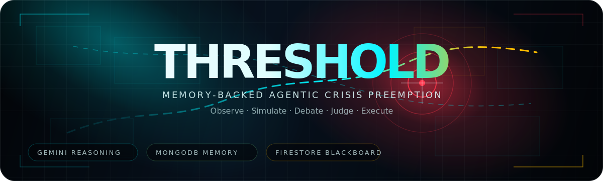
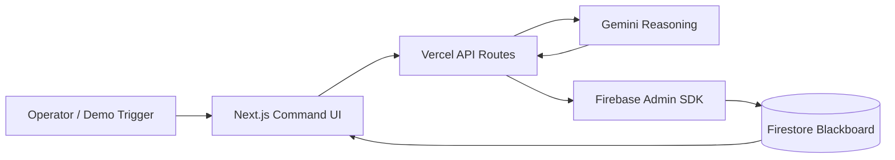

<p align="center">
  
</p>

<p align="center">
  <strong>Autonomous crisis preemption command.</strong><br />
  A Gemini-powered multi-agent system that watches a live crisis state, simulates futures, debates response paths, and writes operational decisions to a shared Firestore blackboard before impact.
</p>

[](https://nextjs.org/)
[](https://ai.google.dev/)
[](https://www.mongodb.com/atlas)
[](https://firebase.google.com/)
[](https://vercel.com/)

## Creator

Built by **Aayu Wadhwani** for the **Google Cloud Rapid Agent Hackathon**.

THRESHOLD uses Gemini as the reasoning engine, Firebase Firestore as the live blackboard, and MongoDB Atlas as incident memory.

## Live Demo

**Project URL:** https://threshold-psi-tawny.vercel.app

> Demo tip: click **Wind Shift** or **Bridge Collapse** and watch the blackboard update live.

## MongoDB Partner Integration

THRESHOLD uses **MongoDB Atlas as persistent incident memory**.

Every Gemini-generated crisis run is stored in MongoDB as precedent. On future crisis triggers, THRESHOLD retrieves relevant prior incidents from MongoDB and injects them into Gemini context before generating new futures, debate, and judge decisions.

```txt
MongoDB Atlas = long-term incident memory
Firestore    = live operational blackboard
Gemini       = simulation + council + judge reasoning
```

Quick verification endpoint:

```txt
/api/debug/mongo
```

---

## The Problem

District emergency teams often operate inside a delay loop:

1. Signals arrive from different systems.
2. Humans wait for reports to consolidate.
3. Response plans are debated manually.
4. Action starts after the threat has already moved.

In a flood, plume drift, bridge collapse, crowd surge, or transit failure, minutes are not administrative. They are survival margin.

**THRESHOLD is built for the moment before the report is complete.**

---

## The Idea

THRESHOLD is not a chatbot.

It is a **multi-agent crisis command interface** where agents share state through a central blackboard:

```txt
SENTINEL   observes the incident
SIMULACRA  generates possible futures
COUNCIL    debates response tradeoffs
JUDGE      selects the strongest path
EXECUTOR   arms or rejects deployment
```

The result is a live command-center experience where judges can see the system reason, adapt, and write decisions in real time.

---

## What It Does

- Renders a cinematic tactical command interface.
- Listens to a live Firestore document: `current_crisis_state / active`.
- Lets the operator trigger crisis mutations:
  - **Baseline Flood Escalation**
  - **Wind Shift // Contamination Drift**
  - **Bridge Collapse // Route Failure**
- Calls Gemini from secure Vercel API routes.
- Generates:
  - scenario branches,
  - resource/casualty estimates,
  - council debate messages,
  - judge decision and confidence.
- Writes the generated result back to Firestore using Firebase Admin.
- Updates the UI live through the Firestore listener.
- Keeps human-in-the-loop controls through **Approve** and **Reject**.

---

## Why It Matters

Emergency systems are usually built around reporting. THRESHOLD is built around **preemption**.

The system does not merely explain a crisis. It creates a structured action path:

```txt
signal → simulation → debate → decision → deployment state
```

This makes it useful for:

- district emergency operations,
- flood and storm response,
- transit disruption planning,
- large-event safety operations,
- public infrastructure risk response.

---

## Demo Flow

Use this sequence for judging:

1. Open the live demo.
2. Confirm the top bar shows:
   ```txt
   Firestore Blackboard / Listening
   ```
3. Show the tactical map, Agent Stream, Decision Card, SIMULACRA Futures, and Council Debate.
4. Click **Wind Shift**.
5. The UI displays a live Gemini thinking state:
   ```txt
   SIMULACRA is generating futures.
   COUNCIL is reconvening.
   JUDGE is preparing synthesis.
   ```
6. Gemini writes generated branches/debate/decision into Firestore.
7. The UI updates live.
8. Click **Approve**.
9. EXECUTOR writes an approval event to the blackboard.

### Keyboard Shortcuts

| Key | Action |
|---|---|
| `1` | Baseline scenario |
| `2` | Wind Shift |
| `3` | Bridge Collapse |
| `0` | Reset baseline |
| `A` | Approve current decision |
| `R` | Reject current decision |

---

## Architecture



### Blackboard Path

```txt
Collection: current_crisis_state
Document:   active
```

The frontend subscribes to this document. API routes write into it. This creates the real-time agent loop.

### MongoDB Incident Memory

THRESHOLD includes an optional MongoDB Atlas memory layer:

```txt
MONGODB_URI
MONGODB_DB=threshold
MONGODB_MEMORY_COLLECTION=incident_memory
```

When enabled, each generated crisis run is stored as an incident memory. Future triggers retrieve relevant records by scenario tags such as `wind`, `plume`, `bridge`, `route-failure`, and `flood`. Those records are passed into Gemini as precedent context before it generates the next set of futures and debate messages.

---

## Agent Model

### SENTINEL
Detects incident signals and writes observations.

### SIMULACRA
Uses Gemini to generate branching futures with probability, resource cost, and casualty estimates.

### COUNCIL
Models competing operational values:

- **Pragmatist:** save the most lives.
- **Accountant:** preserve resources and infrastructure.
- **Ethicist:** protect vulnerable communities.

### JUDGE
Synthesizes the debate into one response path.

### EXECUTOR
Records operator approval/rejection and moves the decision into execution state.

---

## Tech Stack

| Layer | Technology |
|---|---|
| Frontend | Next.js 15 + React 19 + TypeScript |
| Motion/UI | GSAP + CSS tactical HUD system |
| AI Reasoning | Gemini API |
| Partner Memory | MongoDB Atlas incident memory |
| Live State | Firebase Firestore |
| Server Writes | Firebase Admin SDK |
| Backend | Vercel API Routes |
| Hosting | Vercel |

---

## API Routes

| Route | Method | Purpose |
|---|---:|---|
| `/api/trigger/baseline` | POST | Reset to baseline crisis |
| `/api/trigger/wind-shift` | POST | Trigger wind/plume mutation |
| `/api/trigger/bridge-collapse` | POST | Trigger route-failure mutation |
| `/api/decision/approve` | POST | Approve current response |
| `/api/decision/reject` | POST | Reject current response |
| `/api/debug/status` | GET | Safe diagnostic check for Firebase/Gemini env |
| `/api/debug/mongo` | GET/POST | Verify MongoDB connection and test memory insert |

---

## Local Setup

### 1. Install

```bash
npm install
```

### 2. Create `.env.local`

```env
NEXT_PUBLIC_DEMO_MODE=false
NEXT_PUBLIC_FIREBASE_API_KEY=
NEXT_PUBLIC_FIREBASE_AUTH_DOMAIN=
NEXT_PUBLIC_FIREBASE_PROJECT_ID=
NEXT_PUBLIC_FIREBASE_STORAGE_BUCKET=
NEXT_PUBLIC_FIREBASE_MESSAGING_SENDER_ID=
NEXT_PUBLIC_FIREBASE_APP_ID=
NEXT_PUBLIC_FIRESTORE_BLACKBOARD_DOC=active

FIREBASE_SERVICE_ACCOUNT_JSON=
GEMINI_API_KEY=
GEMINI_MODEL=gemini-2.5-flash
MONGODB_URI=
MONGODB_DB=threshold
MONGODB_MEMORY_COLLECTION=incident_memory
```

### 3. Run

```bash
npm run dev
```

Open:

```txt
http://localhost:3000
```

---

## Firestore Document Shape

```json
{
  "systemName": "THRESHOLD",
  "city": "Metropolitan South Grid",
  "sector": "Sector 4",
  "activeMutation": "Baseline Flood Escalation",
  "threatIndex": 9.1,
  "consensus": 92,
  "reviewWindowSec": 88,
  "forecastWindowMin": 41,
  "agentCount": 8,
  "triggerState": "HUMAN REVIEW",
  "hotspotLevel": 0.74,
  "decision": {
    "action": "Evacuate Ward A First",
    "confidence": 92,
    "reasoning": "Optimized for life-safety over asset-protection.",
    "status": "AUTO_ARMED"
  },
  "eventStream": [],
  "debate": [],
  "branches": [],
  "writes": []
}
```

---

## Google Cloud Rapid Agent Hackathon Alignment

The hackathon asks builders to move beyond chat and create agents that reason, plan, and execute tasks under human oversight. THRESHOLD does that by turning Gemini into an operational agent loop rather than a Q&A interface.

### Judging Criteria Alignment

| Criterion | THRESHOLD Response |
|---|---|
| Technological Implementation | Live Firestore blackboard, Vercel API routes, Gemini-generated reasoning, Firebase Admin writes, real-time UI listener |
| Design | Cinematic tactical command interface with live stream, map, futures, debate, decision state, and operator controls |
| Potential Impact | Helps emergency teams reason earlier during flood, bridge, transit, and event-safety crises |
| Quality of Idea | Multi-agent cognitive architecture for preemption, not another chatbot |

### Partner Track Note

THRESHOLD is being extended through the **MongoDB partner track** as an incident memory layer. MongoDB stores prior crisis states, selected response branches, debate summaries, and judge decisions. When a new crisis mutation is triggered, THRESHOLD retrieves relevant precedent records and injects them into Gemini context before SIMULACRA generates futures.

This turns the system from one-off reasoning into memory-backed crisis preemption.

Planned MCP framing for submission: MongoDB MCP gives the agent access to operational precedent memory and incident retrieval tools.

---

## What Makes It Different

Most AI demos stop at conversation.

THRESHOLD shows:

- multiple agent roles,
- tool-backed state writes,
- generated simulations,
- council debate,
- judge synthesis,
- human approval,
- live operational UI.

The demo moment is simple:

> Change one crisis variable. Watch the agents re-think the city.

---

## Current Status

### Completed

- Tactical command-center frontend
- Firestore blackboard listener
- Vercel API write routes
- Firebase Admin backend writes
- Gemini-generated simulation, debate, and decision output
- Human-in-the-loop approve/reject flow
- MongoDB Atlas incident memory scaffold
- Incident memory retrieval and persistence hooks
- Debug endpoints for Firebase, Gemini, and MongoDB health checks

### Next Production Extensions

- MongoDB MCP server wiring for final partner-track validation
- Operator authentication
- Real alerting and dispatch integrations

---

## License

MIT — see [`LICENSE`](./LICENSE).
